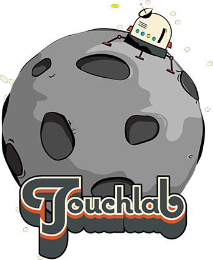

# Concurrency How-to Base Project

---

### About Touchlab

Touchlab is a mobile-focused development agency based in NYC. We have been working on Android since the beginning, and have worked on a wide range of mobile and hardware projects for the past decade. Over the past few years, we have invested significantly on R&D for code sharing technologies. We believe strongly in KMP's future and are making the Kotlin platform the focus of our business.

### What We Can Do For You

We have made KMP the focus of Touchlab. We had possibly the first KMP* app published in the iOS App Store, and have extensive experience in building libraries and the Kotlin platform, including contributions to Kotlin/Native itself. We can establish and accelerate your adoption of shared Kotlin code. See [touchlab.co](https://touchlab.co) for more info.

